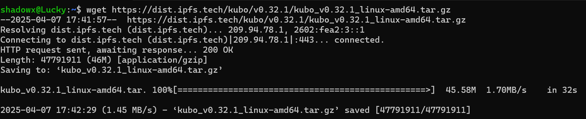
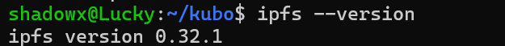
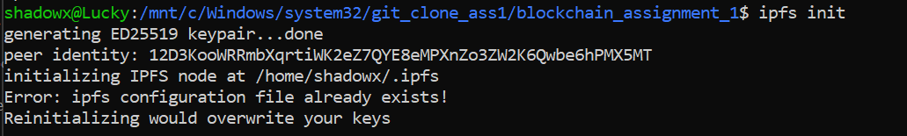
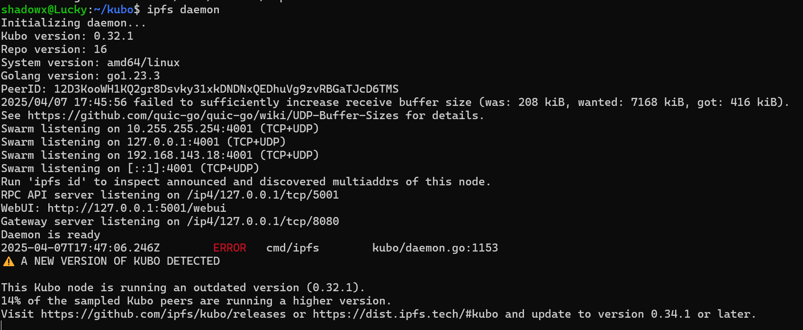
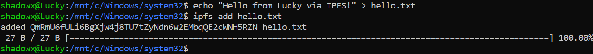
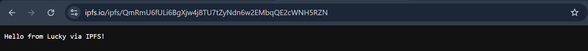
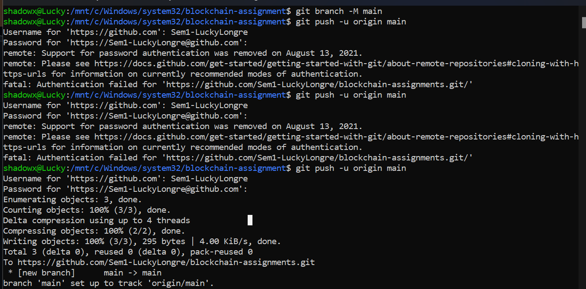
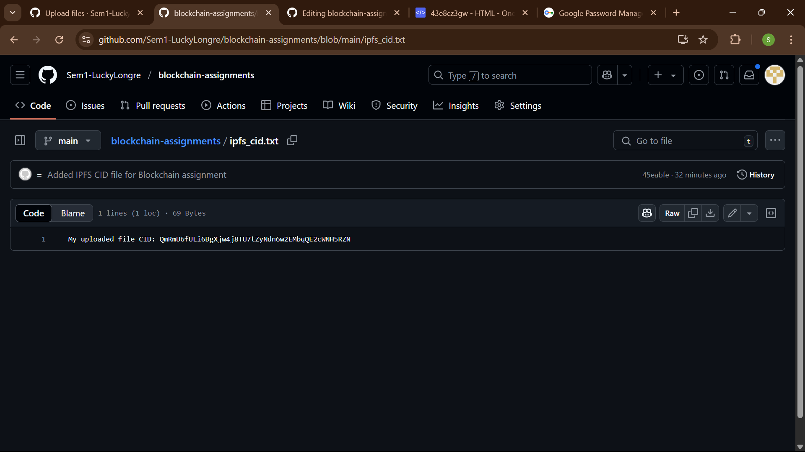

# IPFS Blockchain Assignment

This assignment demonstrates how to install IPFS, run the daemon, upload a file, retrieve its CID, and push it to a GitHub repository using WSL (Windows Subsystem for Linux).

## Steps Performed ✅

### 1. IPFS Installation
Installed Kubo (IPFS) version 0.32.1 using `wget` and extracted the contents.

```bash
wget https://dist.ipfs.tech/kubo/v0.32.1/kubo_v0.32.1_linux-amd64.tar.gz
tar -xvzf kubo_v0.32.1_linux-amd64.tar.gz
cd kubo
sudo bash install.sh
```

📸 **Screenshot:** Successfully installed IPFS and verified version using `ipfs --version`




---

### 2. IPFS Initialization
Initialized IPFS and generated the peer identity.

```bash
ipfs init
```

📸 **Screenshot:** Output showing the Peer identity and repository initialized.



---

### 3. Running the IPFS Daemon
Started the IPFS daemon to initialize the node.

```bash
ipfs daemon
```

📸 **Screenshot:** Daemon started successfully with WebUI and Gateway URLs displayed.



---

### 4. Uploading a File to IPFS
Created a `hello.txt` file and added it to IPFS to get its unique content identifier (CID).

```bash
echo "Hello from Lucky!" > hello.txt
ipfs add hello.txt
```

📸 **Screenshot:** `hello.txt` added and CID shown in terminal.



---

### 5. Creating CID File
Saved the CID from the previous step to a new file named `ipfs_cid.txt`.

```bash
echo "QmbLWQTZZspap5tE5G4taxuRhqFJayDtge58cPFEvYFi1n" > ipfs_cid.txt
```

📸 **Screenshot:** Created the `ipfs_cid.txt` file with the CID.



---

### 6. Git Configuration and GitHub Repository Setup
Initialized Git, configured identity, committed files, added remote, and pushed to GitHub.

```bash
git init
git config --global user.name "Lucky Longre"
git config --global user.email "sem1luckylongre@gmail.com"
git add .
git commit -m "Added IPFS CID file for Blockchain assignment"
git branch -M main
git remote add origin https://github.com/Sem1-LuckyLongre/blockchain-assignments.git
git push -u origin main
```

📸 **Screenshot:** Commit and push to GitHub completed successfully.



---

### 7. GitHub Repository View
Viewed the pushed files on the GitHub repository page.

📸 **Screenshot:** Repository showing `hello.txt` and `ipfs_cid.txt`.



---

## Conclusion ✅
Successfully installed and run IPFS, uploaded a file, retrieved its CID, and pushed it to GitHub via WSL.

GitHub Repository 📂: [blockchain-assignments](https://github.com/Sem2-LuckyLongre/blockchain_assignment_1)

Check your file directly on the IPFS Gateway:

🔗 [https://ipfs.io/ipfs/QmRmU6fULi6BgXjw4j8TU7tZyNdn6w2EMbqQE2cWNH5RZN](https://ipfs.io/ipfs/QmbLWQTZZspap5tE5G4taxuRhqFJayDtge58cPFEvYFi1n)
